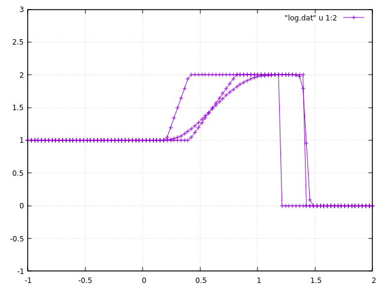

# Advection

## 1-Dim Navier Stokes equation.

$u$ is the velocity of the gas, $p$ is the pressure, $\rho$ is the molar density, $R$ is the ideal gas constant, $T$ is the absolute temperature.

$$
\frac{\partial \left( \rho u \right)}{\partial t} + \frac{\partial \left( \rho u^2 \right)}{\partial x} = - \frac{\partial p}{\partial x} + \mu \frac{\partial^2 u}{\partial x^2}
$$

$$
\frac{\partial \rho}{\partial t} + \frac{\partial \left( \rho u \right)}{\partial x} = 0.
$$

Equation of states.

$$
p = \rho R T.
$$

In this repository, temperature and molar density is assumed to be a constant.

### $q$-$\rho$ representation.

caseA.

$$
q := \rho u
$$

$$
\frac{\partial q}{\partial t} + \frac{\partial}{\partial x}\left( \frac{q^2}{\rho} \right) = - RT \frac{\partial \rho}{\partial x} + \mu \frac{\partial^2}{\partial x^2} \left( \frac{q}{\rho} \right)
$$

$$
\frac{\partial \rho}{\partial t} + \frac{\partial q}{\partial x} = 0.
$$

### $\rho$ is constants. And viscosity is 0.

$$
\frac{\partial q}{\partial t} + \frac{\partial}{\partial x}\left( \frac{q^2}{\rho} \right) = 0 \ \ \ (\rho = \rm{const.}).
$$

ref: https://math.stackexchange.com/questions/602613/entropy-solution-of-the-burgers-equation

`main.cpp`

```c++
    fluid.print_u();
    fluid.print_exact_solution();
    fluid.print_exact_solution_2_times();
```



This figure was created by the following command line operations.

```
$ make run > log.dat
$ gnuplot
gnuplot> set yr [-1:3]
gnuplot> plot "log.dat" u 1:2 w lp
```