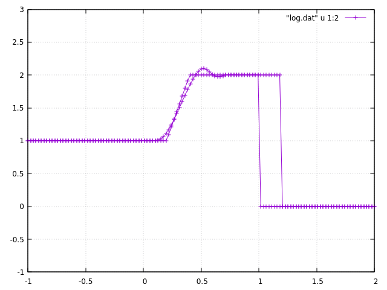

# Advection

## 1-Dim Navier Stokes equation.

$u$ is the velocity of the gas, $p$ is the pressure, $\rho$ is the molar density, $R$ is the ideal gas constant, $T$ is the absolute temperature.

$$
\frac{\partial \left( \rho u \right)}{\partial t} + \frac{\partial \left( \rho u^2 \right)}{\partial x} = - \frac{\partial p}{\partial x} + \mu \frac{\partial^2 u}{\partial x^2}
$$

$$
\frac{\partial \rho}{\partial t} + \frac{\partial \left( \rho u \right)}{\partial x} = 0.
$$

Equation of states.

$$
p = \rho R T.
$$

In this repository, temperature and molar density is assumed to be a constant.

### Navier Stokes equation's caseB form.

Assuming the continuity equation, the Navier-Stokes equation can be transformed as follows.

$$
\rho \left(\frac{\partial u}{\partial t} + u \frac{\partial u }{\partial x} \right)= - \frac{\partial p}{\partial x} + \mu \frac{\partial^2 u}{\partial x^2} \ \ \rm{(caseB).}
$$

## $u$-$\rho$ representation.

$$
\frac{\partial u}{\partial t} + u \frac{\partial u }{\partial x}= - \frac{RT}{\rho}\frac{\partial \rho}{\partial x} + \frac{\mu}{\rho} \frac{\partial^2 u}{\partial x^2} \ \ \rm{(caseB).}
$$

$$
\frac{\partial \rho}{\partial t} + \frac{\partial \left( \rho u \right)}{\partial x} = 0.
$$

