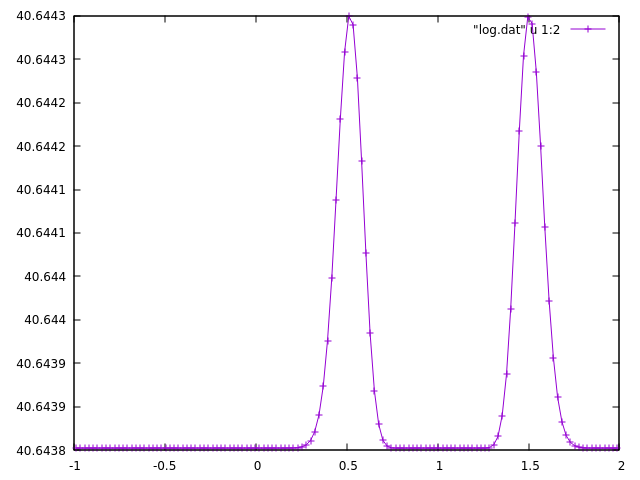
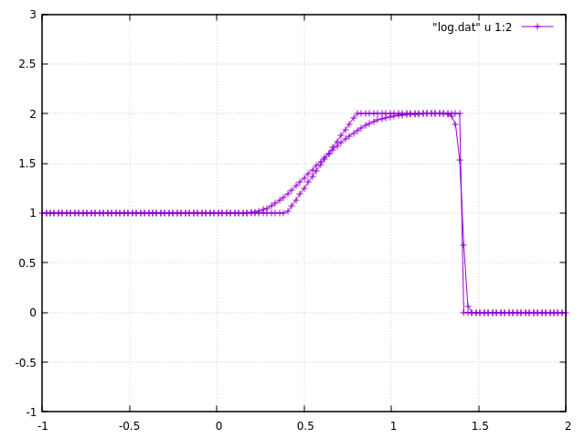
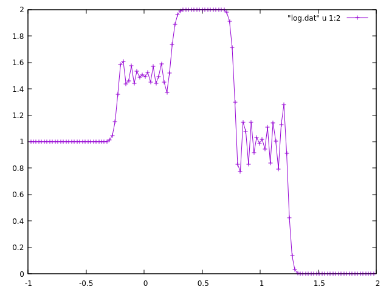

# Advection

## 1-Dim Navier Stokes equation.

$u$ is the velocity of the gas, $p$ is the pressure, $\rho$ is the molar density, $R$ is the ideal gas constant, $T$ is the absolute temperature.

$$
\frac{\partial \left( \rho u \right)}{\partial t} + \frac{\partial \left( \rho u^2 \right)}{\partial x} = - \frac{\partial p}{\partial x} + \mu \frac{\partial^2 u}{\partial x^2}
$$

$$
\frac{\partial \rho}{\partial t} + \frac{\partial \left( \rho u \right)}{\partial x} = 0.
$$

Equation of states.

$$
p = \rho R T.
$$

In this repository, temperature and molar density is assumed to be a constant.

### $q$-$\rho$ representation.

caseA.

$$
q := \rho u
$$

$$
\frac{\partial q}{\partial t} + \frac{\partial}{\partial x}\left( \frac{q^2}{\rho} \right) = - RT \frac{\partial \rho}{\partial x} + \mu \frac{\partial^2}{\partial x^2} \left( \frac{q}{\rho} \right)
$$

$$
\frac{\partial \rho}{\partial t} + \frac{\partial q}{\partial x} = 0.
$$

### Acoustic wave.

```c++
constexpr bool rho_const = false;
```

Initial condition.

```c++
        rho[i] = p0 / (R * T) + 0.001 * exp(- 100.0 * (x - 1.0) * (x - 1.0));
```

```
$ make run > log.dat 
$ gnuplot
gnuplot> plot "log.dat" u 1:2 w lp
```



```c++
constexpr bool rho_const = true;
```

Initial condition.

```c++
        rho[i] = p0 / (R * T);// + 0.001 * exp(- 100.0 * (x - 1.0) * (x - 1.0));
```

```c++
        if (x < 0){
            q[i] = rho[i] * 1.0;
        } else if (x >= 0 && x < 1){
            q[i] = rho[i] * 2.0;
        } else {
            q[i] = rho[i] * 0.0;
        }
```

```
$ make run > log.dat 
$ gnuplot
gnuplot> plot "log.dat" u 1:2 w lp
```



```c++
    fluid.print_u();
    fluid.print_exact_solution_2_times();
```

rho_const: true.

```c++
constexpr double time_end = 0.005;
constexpr bool rho_const = false;
```

